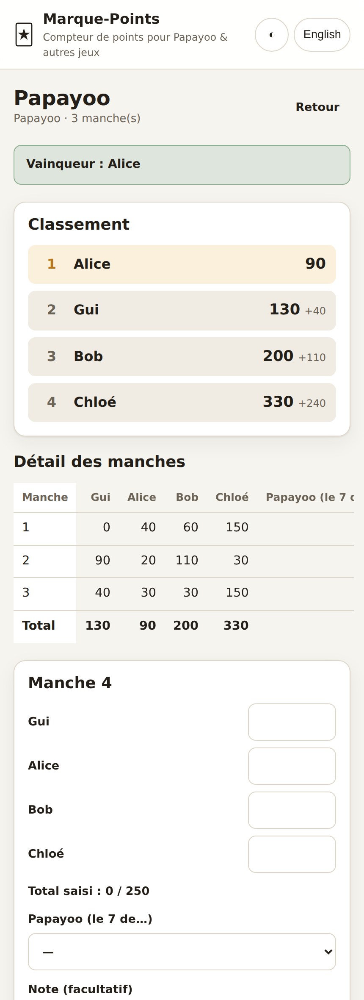
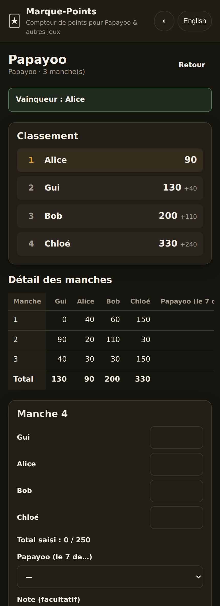

# 🃏 Together

Quatre onglets et un « + », une seule app. **Accueil** : ce qui vous attend,
ce qui vient, ce qui est en cours — et, d'une rangée *Tout · Listes · Sondages
· Parties · Comptes · Idées*, chaque sorte en entier : des **listes** à cocher
et à répartir, des **sondages** pour trancher une date ou un choix, un compteur
de points pour Papayoo et une vingtaine d'autres **parties**, des **comptes** de
dépenses (qui a payé quoi, qui rembourse qui), des tableaux d'**idées** (notes
et croquis au doigt). **Agenda** : les sondages qui
cherchent un jour, puis ce qui vient, jour par jour, avec pour chaque
événement sa liste et son compte. **Groupes** : vos groupes, leur page, entrer
et inviter. **Réglages** : votre prénom, vos données, la version. Une page
web, aucune dépendance, aucun build.

<p>
  
  
</p>

## Ce que ça fait — les parties

- **Une partie = des manches** : on saisit le score de chaque joueur, l'appli
  tient les totaux, le classement (ex æquo compris) et l'écart avec le leader.
- **Les règles de comptage du jeu sont connues** : sens du classement (le plus
  petit ou le plus grand total gagne), fin de partie (score limite, nombre de
  manches fixe, ou à la demande), total attendu par manche.
- **Contrôle de saisie** : à Papayoo une manche distribue exactement 250 points
  de pénalité — si le compte n'y est pas, l'appli le signale avant d'enregistrer.
  Le bouton *Compléter* remplit automatiquement le dernier score manquant.
- **Elle s'installe et marche hors ligne** : ajoutée à l'écran d'accueil, elle
  s'ouvre sans réseau — dans un train, une cave, un gîte — et se resynchronise
  au retour de la connexion.
- **Les résultats s'exportent** : un récapitulatif en texte à coller dans une
  conversation, ou un fichier **Word** et **PDF** du classement et des manches.
- **Statistiques par joueur** : parties jouées, gagnées, moyenne et meilleur
  score, jeu par jeu.
- **Rejouer** relance une partie avec les mêmes joueurs et les mêmes règles, et
  les noms déjà utilisés sont proposés à la saisie.
- **Le donneur tourne** : l'app rappelle à qui c'est de donner.
- **Passer l'app à quelqu'un, avec ou sans les parties** : *Partager l'app*, sur
  l'accueil, propose trois liens — l'app seule (la personne repart de zéro),
  l'app **avec toutes** vos parties, ou l'app avec **celles que vous cochez**.
  Le lien part par la feuille de partage du téléphone, ou s'affiche à copier avec
  un **code QR** ; il reste court quel que soit le nombre de parties, parce qu'il
  ne porte pas les parties mais un identifiant qui les désigne.
- **Le partage tient dans une idée : le groupe.** Un groupe — la famille, les
  copains du mardi — est un cercle de personnes. On y voit tout ce qui est
  partagé, parties, listes et sondages confondus, et on peut y partager à son
  tour ; qui n'en est pas ne peut rien y créer, même en récupérant la clé
  publique dans le code de la page. **Contribuer, en revanche, ne demande
  rien** : un lien envoyé à quelqu'un d'extérieur lui permet d'ajouter une
  manche ou de cocher une ligne, sans rien voir du reste.
- **On frappe à un groupe, et quelqu'un ouvre.** Vous envoyez un lien —
  d'une journée, pour plusieurs personnes ou pour une seule.
  En face, il n'y a qu'**un prénom à écrire** : rien ne s'ouvre, la demande
  arrive chez vous, et vous **acceptez ou refusez** d'une touche. Une invitation
  ne donne donc que le droit de frapper : transférée ou capturée, elle ne fait
  entrer personne sans vous. Accepté, l'appareil reçoit **une clé à lui**,
  étiquetée de ce prénom et coupable sans déranger les autres ; refusé, il n'a
  jamais rien vu. Le lien ne passe pas ? Le nom du groupe et les six chiffres,
  dits de vive voix, font exactement la même chose.
- **Chacun a son lien de retour.** Accepter quelqu'un fait entrer une *personne* :
  ses appareils ont chacun leur clé, mais tous lui appartiennent — et elle peut se
  faire un **lien à elle** qui rend une clé neuve à n'importe quel navigateur,
  sans que personne n'ait à l'accepter de nouveau. C'est la réponse aux deux vrais
  agacements : être entré depuis le navigateur d'une app de messagerie et vouloir
  la même chose dans Safari, et réinstaller l'app. Ce lien **naît sur son
  appareil** — celui qui fait entrer ne le voit jamais et ne peut donc pas se faire
  passer pour elle — et se **coupe** depuis *Qui est dans le groupe* sans mettre
  ses appareils dehors.
- **La porte reste entre vos mains.** Seule la clé affichée à la création du
  groupe accepte les demandes ; celles distribuées ensuite voient et partagent,
  mais n'ouvrent à personne. *Qui est dans le groupe* liste les appareils, un par
  ligne, et **Couper** met l'un d'eux dehors sans toucher aux autres — la
  dernière clé qui fait entrer étant protégée, un groupe ne peut pas se retrouver
  sans portier. Vingt essais ratés ferment l'entrée dix minutes ; cinquante
  demandes en attente et la porte n'en prend plus.
- **Elle se met à jour toute seule, et le dit.** L'app demande à chaque retour au
  premier plan s'il existe une version plus récente et se recharge une fois quand
  c'est le cas ; chaque fichier est revalidé plutôt que pris dans le cache du
  navigateur. La version est affichée dans Réglages, sous *Données*, avec un
  bouton pour chercher une mise à jour — parce qu'une app posée sur un écran
  d'accueil est reprise, jamais rechargée, et peut rester bloquée sans rien dire.
- **Ce qui est poussé ailleurs arrive ici tout seul** : en ouvrant l'app et
  chaque fois qu'on y revient, elle va chercher ce que le groupe a partagé
  depuis — Safari et l'app de l'écran d'accueil sont deux appareils, et ne se
  parlent que par la base. Le bouton **⟳** de la barre du haut le fait sur
  commande et dit combien d'éléments sont arrivés ; un document ouvert à l'écran,
  lui, se met à jour toutes les cinq secondes.
- **Ce prénom sert ensuite partout** : le groupe voit qui est entré, et vous êtes
  proposé en premier dans une nouvelle liste, un sondage ou une partie — proposé
  une fois, au moment où le formulaire est vide ; effacé, il reste effacé. Il ne
  part de l'appareil que de deux façons : comme étiquette de sa clé, et comme
  n'importe quel prénom écrit dans une liste, qui suit cette liste quand elle
  est partagée.
- **Et pour faire entrer quelqu'un d'un coup, sans lui donner la clé** : un lien
  qui porte plusieurs documents, fermé par un **code à six chiffres** tiré au
  hasard — dix essais, puis il se bloque. Le lien et le code voyagent séparément,
  exprès : *Copier* ne copie que le lien. Ce que le lot désigne est chiffré avec
  ce code, donc la base elle-même ne le sait pas. *Mes partages*, dans l'onglet
  Réglages, rappelle chaque code et permet de **révoquer** un lien déjà envoyé.
- **Parties partagées, à la demande** : branchée sur une base (voir
  [docs/DEPLOIEMENT.md](docs/DEPLOIEMENT.md)), l'appli donne un lien par partie.
  La personne qui le reçoit ouvre la même partie, avec ses scores, et peut y
  ajouter des manches — chaque écran se rafraîchit tout seul. Rien ne quitte
  l'appareil tant que personne n'a appuyé sur *Partager*.
- **Le Tarot se calcule tout seul** : preneur, contrat, bouts et points réalisés,
  et l'appli en tire le score de chacun — en montrant son calcul, pour qu'il soit
  vérifiable à la table.
- **Compter les cartes au doigt** : pour les jeux dont le score est une pile de
  cartes, un compteur s'ouvre depuis la manche en cours. On touche les cartes
  ramassées, il fait la somme et reporte le score — plus d'addition de tête.
- **Correction** : on clique sur une ligne du tableau pour modifier ou supprimer
  une manche, *Annuler la dernière manche* défait la saisie précédente, et
  *Renommer* corrige un nom mal saisi sans toucher aux scores.
- **Ça marche sur téléphone**, hors ligne, en français ou en anglais, en thème
  clair ou sombre. Les parties sont enregistrées dans le navigateur, et
  exportables en JSON pour sauvegarder ou changer d'appareil.

## Ce que ça fait — les listes

Une liste, c'est **un titre**, **des gens**, et **des lignes**. Rien à régler
d'autre : le titre dit le contexte — *Courses de samedi*, *Valise Corse*,
*Déménagement* — et une ligne est du texte libre, action ou objet, les deux
mélangés si besoin.

- **Attribuer** : on touche une ligne pour la donner à quelqu'un, ou à personne.
  *Répartir* distribue d'un coup ce que personne n'a pris, en servant d'abord
  celui qui en a le moins.
- **Cocher** ce qui est fait, et filtrer d'un geste : tout, une personne, ou ce
  que personne n'a pris.
- **Coller une liste entière** d'un message : les puces et la numérotation sont
  nettoyées, les quantités gardées (« 2 baguettes » reste deux baguettes).
- **Reprendre cette liste** décoche tout et garde les lignes — la valise, les
  courses de base, la liste de sortie, sans notion de modèle à gérer.
- **Partager** comme une partie : un lien, un code QR, et chacun coche de son
  côté. Deux personnes qui cochent en même temps gardent chacune leur coche.

Ce qui n'y est délibérément pas : catégories, échéances, récurrences, charge à
équilibrer. Ça s'ajoutera si l'usage le réclame, et pour ce qu'il réclame.

### Les jours, les modèles, l'archive

- Une ligne peut porter **un jour** — pas une heure : « réserver le camion »
  est pour mardi, et un jour tout seul veut dire la même chose sur deux
  téléphones. Ce qui a dépassé son jour passe en rouge, et se compte sur la
  carte de la liste, dans le bloc du groupe et sur la page de la personne.
- Une liste peut être gardée comme **modèle** — la valise, les courses de la
  semaine. Elle quitte « En cours », attend dans *Modèles*, et l'écran de
  création propose d'en couper une nouvelle : les lignes et les personnes
  reviennent, les coches et les jours non.
- **Archiver** range une liste, un sondage ou une partie sans rien supprimer :
  hors des sections, hors des comptes, repliés derrière une ligne en bas de
  l'onglet. Ce qui est archivé reste dans l'histoire — les statistiques et les
  parties passées d'une personne le gardent.

## Ce que ça fait — l'agenda

Un sondage qui a tranché retient **la date**, et l'heure si vous en voulez une.
De là, deux chemins vers les vrais agendas :

- **Ajouter à l'agenda** télécharge un fichier `.ics` — l'événement s'ouvre dans
  le calendrier du téléphone comme n'importe quelle pièce jointe. Rien à
  déployer, ça marche tout de suite.
- **L'agenda du groupe** donne une **adresse d'abonnement** : collée dans
  Calendrier, Google Agenda ou FamilyWall, elle y fait apparaître toute seules
  les dates retenues du groupe et ses lignes datées. Elle demande la fonction
  `agenda` déployée sur Supabase (guide, étape 8), se coupe depuis l'app, et ne
  donne que des dates — ni scores, ni clés, ni rien d'un autre groupe.

Les événements sont des **journées**, pas des instants, sauf si une heure a été
donnée ; et une heure est écrite sans fuseau, donc vingt heures reste vingt
heures où qu'on la lise.

## Ce que ça fait — l'événement

Un sondage qui a retenu sa date devient **l'événement** : sous la date, son
organisateur ouvre d'une touche **la liste de ce qu'on apporte** et **le compte
des dépenses**. Tous deux prennent le nom de l'événement, son groupe, et les
personnes dispo sur le choix qui l'a emporté (tout le monde s'il y a égalité).
Le sondage montre ensuite où en sont la liste et le compte ; la liste et le
compte ramènent au sondage. Rien de nouveau n'est stocké : la liste et le
compte disent pour quel sondage ils ont été faits.

Quand le jour est déjà connu, pas besoin de sondage : **+ Événement**, dans
l'onglet Agenda, demande un nom, le jour, l'heure si on veut, et qui vient. Il
s'ouvre sur la même page, sans rien à voter (en coulisse : un sondage déjà
tranché, sans choix).

Un événement peut durer **plusieurs jours** (un week-end, des vacances) : le
champ facultatif *Jusqu'au*, à la création ou sur sa page, fixe le dernier jour.
Il s'affiche « du … au … », reste dans « À venir » tant que son dernier jour
n'est pas passé, et part dans les agendas sur toute sa durée (avec une heure :
de cette heure le premier jour jusqu'à la fin du dernier).

L'onglet **Agenda** montre :

- **À décider** : les sondages ouverts qui cherchent un jour. L'app les
  reconnaît à la question (« quel soir… », « quand… ») ou à des choix qui se
  lisent comme des jours (« samedi 12 », « 12/10 »). Une fois le jour retenu,
  le sondage descend simplement dans « À venir » ; les autres questions
  (« quel cadeau ? ») restent sur l'Accueil ;
- **À venir** : les événements par date, qu'ils viennent d'un sondage ou non,
  chacun avec où en sont sa liste et son compte ;
- **Passés**, repliés en bas.

Les comptes ont leur place sur l'Accueil, sous **Comptes** (`#/spends`) : en
cours, puis soldés.

Avec au moins un groupe, une pastille **Autres** rejoint *Tous* et les groupes
dans chaque onglet : ce qui n'est dans aucun groupe — gardé pour soi, envoyé
par lien seulement, ou venu d'un groupe dont l'appareil n'est pas.

## Ce que ça fait — les sondages

Une question, des choix, et une grille : **chacun coche les choix qui lui
vont**, et rien d'autre — pas de « non », pas de « peut-être ». C'est la forme
du « quel soir ? », et choisir une chose parmi plusieurs, c'est la même grille
avec une seule coche dedans. Donc pas de type de sondage à choisir avant de
poser la question.

- On touche une case pour dire « dispo », on la retouche pour l'enlever. **Ne
  pas avoir répondu n'est pas un non** — le compte dit combien ont répondu.
- Une jauge horizontale classe les choix par nombre de personnes dispo ; à
  égalité, l'ordre d'écriture décide.
- **Clore** le sondage fige les réponses ; on peut le rouvrir.
- **Partager** comme le reste : un lien, un code QR, chacun répond de son côté,
  et les réponses de chacun arrivent sans écraser celles des autres.

## Ce que ça fait — par groupe, et par personne

Avec plusieurs groupes, l'app ne mélange plus tout.

- Les onglets sont **en bas de l'écran**, à portée du pouce, et y restent quand
  on fait défiler : Accueil et Agenda à gauche, Groupes et Réglages à droite.
  Ils répondent à une question — quoi, quand, avec qui — plutôt que de ranger
  par sorte ; les sortes sont la rangée du haut de l'Accueil, et leurs
  adresses (`#/lists`, `#/polls`, `#/games`, `#/spends`) marchent toujours.
- **Pour vous**, en tête de l'Accueil : les sondages où votre prénom n'a pas
  répondu, les lignes qui vous sont confiées (en retard d'abord), l'argent que
  vous devez, et les personnes qui frappent à la porte d'un groupe que vous
  ouvrez. Sans prénom (Réglages), l'Accueil le dit. Pile au
  milieu, à cheval sur la barre, un **« + »** crée une liste, un sondage, un
  événement, une partie ou un compte, depuis n'importe quelle page ; il dit
  dans quel groupe la chose ira (modifiable sur le formulaire).
- L'onglet **Groupes** ouvre sur un bloc par groupe : combien de listes, de
  sondages, de parties et de comptes y sont en cours. Chaque chiffre est un bouton — il ouvre l'onglet
  correspondant, déjà réglé sur ce groupe. Le nom du groupe ouvre **sa page**
  (`#/group/<id>`) : tout ce qui y est en cours, sur une seule page — ce qui
  vient, les listes, les sondages, les parties, les comptes à solder — avec
  « Tout voir » vers l'onglet, déjà réglé sur ce groupe. Repliée en bas :
  « Voir qui doit quoi », les prénoms de ce groupe et ce qui les attend.
- L'Accueil et l'Agenda portent alors les mêmes **pastilles** : *Tous*, puis un
  groupe par pastille. Le choix tient d'un onglet à l'autre et d'une ouverture à
  la suivante — regarder un groupe, c'est regarder ses listes *et* ses sondages
  *et* ses parties. Avec un seul groupe, il n'y a rien à choisir : pas de
  pastilles.
- **La page d'une personne** (`#/person/<nom>`) résume ce qui l'attend : ses
  lignes à faire, ses votes donnés ou manquants, ses dernières parties avec son
  rang. Les prénoms y sont rapprochés sans accent ni majuscule, comme dans les
  statistiques — « alice » et « Alice » sont la même personne, « Alex » et
  « Alexandre » restent deux. On y arrive depuis la page d'un groupe (« Voir
  qui doit quoi ») ou les statistiques (renommer).
- **Renommer partout**, depuis sa page ou depuis les statistiques, suit la
  personne dans les parties, les listes et les sondages à la fois : deux
  orthographes redeviennent une seule personne partout d'un coup.

## Ce que ça fait — les comptes

Un compte — vacances, coloc, week-end — tient des personnes et des lignes.
Chaque ligne dit ce qui a été payé, combien, par qui, et pour qui.

- **La page d'un compte a deux volets** : *Dépenses* (le formulaire pour noter,
  la liste des lignes) et *Soldes* (qui a trop avancé, qui rembourse qui —
  « Tout est réglé » quand il n'y a rien à faire). Un bandeau en haut bascule
  de l'un à l'autre.
- **Le partage est égal** entre les personnes cochées, toutes par défaut :
  noter une baguette ne demande que deux champs, et une case à décocher fait
  qu'une ligne ne concerne que certains — le taxi de la gare.
- **Qui rembourse qui**, en aussi peu de virements que possible : le plus gros
  débiteur paie le plus gros créancier, et on recommence. Au plus une
  personne de moins qu'il n'y en a.
- **Un virement fait se note** : « Marquer comme payé », sous chaque virement,
  ajoute un remboursement (montant modifiable, pour un remboursement partiel).
  Il apparaît dans les dépenses, en gris, remet les soldes d'aplomb, et ne
  compte ni dans le total du compte ni dans ce que chacun a avancé. Touché
  dans la liste, il se corrige ou se retire.
- **L'argent est compté en centimes, en entiers.** Dix euros entre trois font
  3,34 / 3,33 / 3,33, et le centime qui reste va toujours au même — sans quoi
  deux téléphones finiraient par ne pas être d'accord.
- **On ne retire pas quelqu'un qui a avancé de l'argent** : le compte cesserait
  de tomber juste sans rien dire. L'app refuse et explique quoi faire d'abord.
- Partagé comme le reste : chacun note de son côté, et les lignes se réunissent
  sans qu'aucune n'en chasse une autre.

## Ce que ça fait — les idées

Un tableau d'idées — un voyage, un cadeau, un projet — tient ce qui vient avant
de décider : des **notes** et des **croquis**, chacun sur sa carte.

- **Des cartes, pas une grande page** : deux personnes qui écrivent en même
  temps ne s'écrasent pas, chacune ajoute les siennes. La plus récente vient en
  premier.
- **Une note**, c'est du texte libre : une idée, une adresse, un lien. Ce qui
  est tapé est gardé à la fermeture, quelle qu'elle soit ; une note laissée
  vide n'est pas créée.
- **Un croquis** se dessine au doigt ou à la souris : cinq couleurs (l'encre
  suit le thème, foncée en clair, claire en sombre), trois épaisseurs, une
  gomme qui efface le trait qu'elle touche, *Annuler*, et une légende.
- **Gardé en traits, pas en image** : chaque trait est une suite de points
  (allégée des points inutiles) dans un cadre fixe de 1000 × 750. C'est léger
  pour la base, net sur tous les écrans, et deux personnes qui dessinent sur
  le même croquis gardent chacune leurs traits. Un tableau trop lourd pour la
  base le dit avant d'écrire.
- **Supprimer d'un glissement**, comme partout ailleurs (voir plus bas).
- Où va un tableau se dit sur le formulaire, comme pour une liste : un groupe,
  *Lien seulement*, ou *Garder pour moi*.
- Partagé comme le reste, archivé, copié vers un autre groupe. Pas encore de
  schémas (boîtes et flèches) ni de photos.

## Supprimer d'un glissement

Ce qui se supprime dans une liste de choses se glisse vers la gauche, au doigt
ou à la souris : ça découvre un bouton rouge *Supprimer*, qu'il faut toucher —
un glissement seul n'efface rien, un défilement non plus, et toucher la carte
la referme.

- **Tout de suite** : une ligne de liste, une dépense ou un remboursement, une
  carte d'idée — comme depuis leur fenêtre.
- **Après confirmation** : une liste, un sondage, un événement, une partie, un
  compte ou un tableau d'idées, depuis son onglet ou l'agenda — il est souvent
  à tout le groupe.
- Un sondage organisé par quelqu'un d'autre ne se glisse pas : lui seul peut le
  supprimer.

## Jeux fournis

### Jeux de cartes

| Jeu | Vainqueur | Fin de partie | Total par manche |
| --- | --- | --- | --- |
| Papayoo | plus petit score | 250 points | 250 (210 de Payoos + 40 pour le Papayoo) |
| Hearts / Cœurs | plus petit score | 100 points | 26 |
| Belote / Coinche (par équipes) | plus grand score | 1000 points | 162 |
| Tarot | plus grand score | 5 manches | 0 (somme nulle, scores négatifs autorisés) |
| Skyjo | plus petit score | 100 points | libre |
| 6 qui prend ! | plus petit score | 66 points | libre |
| Uno | plus grand score | 500 points | libre |
| Rami / Rummy | plus grand score | 500 points | libre |
| Mille Bornes | plus grand score | 5000 points | libre |
| Skull King | plus grand score | 10 manches | libre, négatifs autorisés |
| Wizard | plus grand score | 60 ÷ nb de joueurs | libre, négatifs autorisés |
| Canasta | plus grand score | 5000 points | libre, négatifs autorisés |
| Scopa | plus grand score | 11 points | libre |
| Cabo / Dutch | plus petit score | 100 points | libre, négatifs autorisés |
| Président | plus grand score | 10 points | libre, négatifs autorisés |

### Tuiles, lettres et dominos

| Jeu | Vainqueur | Fin de partie | Total par manche |
| --- | --- | --- | --- |
| Rummikub | plus grand score | à la demande | 0 (somme nulle) |
| Dominos | plus grand score | 100 points | libre |
| Scrabble | plus grand score | à la demande | libre (une manche = un coup) |

### Dés, extérieur, et le reste

| Jeu | Vainqueur | Fin de partie | Total par manche |
| --- | --- | --- | --- |
| Yams / Yahtzee | plus grand score | à la demande | libre |
| Pétanque (par équipes) | plus grand score | 13 points | libre (une manche = une mène) |
| Mölkky | plus grand score | 50 points | libre, négatifs autorisés (le retour à 25) |
| Jeu de plateau | plus grand score | à la demande | libre (une manche = une partie) |
| Jeu personnalisé | au choix | au choix | au choix |

Chaque réglage reste modifiable au moment de créer la partie : les variantes de
table sont la règle, pas l'exception. Un total de manche inattendu est un
**avertissement**, jamais un blocage.

### Le compteur de cartes

Cinq jeux se comptent pièce par pièce plutôt qu'en additionnant de tête. Le
bouton 🂠 à côté de chaque joueur ouvre un compteur adapté au jeu :

| Jeu | Ce qu'on touche | Interrupteurs |
| --- | --- | --- |
| Papayoo | les Payoos ramassés, 1 à 20 (une seule fois chacun) | le Papayoo, +40 |
| Skyjo | chaque carte restante devant soi, de -2 à 12 | score doublé |
| Hearts / Cœurs | ♥, une fois par cœur ramassé | dame de pique, +13 |
| 6 qui prend ! | la valeur en têtes de bœuf de chaque carte, 1 / 2 / 3 / 5 / 7 | — |
| Rummikub | les tuiles restées sur le chevalet, joker compris | — |

*Annuler la dernière* corrige une erreur de doigt, *Reporter le score* écrit le
total dans la manche. Le compteur est une calculatrice : seul le total est
enregistré, pas le détail des cartes.

Le **Tarot**, lui, ne se compte pas : il se calcule. Son écran demande le
preneur, le contrat, les bouts et les points réalisés, puis applique la formule
de la fédération — `(25 + écart + petit au bout) × multiplicateur`, la poignée
et le chelem venant après la multiplication — et répartit le résultat entre le
preneur, son appelé éventuel et la défense. Le détail du calcul est affiché,
parce qu'une calculatrice invérifiable ne vaut rien à une table de jeu.

Les autres jeux gardent la saisie directe : la belote mêle les plis et les
annonces, Uno et le Rami dépendent des cartes restées dans la main des autres.

## Utiliser l'appli

### Le plus simple : un seul fichier

[`dist/marque-points.html`](dist/marque-points.html) contient l'appli entière —
HTML, CSS et JavaScript réunis. Téléchargez-le, ouvrez-le par double-clic : pas
de serveur, pas d'installation, et ça marche hors ligne. C'est aussi le format à
envoyer aux autres joueurs, ou à garder sur le téléphone.

Il est reconstruit avec :

```bash
npm run bundle   # → dist/marque-points.html
```

Un test vérifie que le fichier livré correspond bien aux sources.

### Pour développer : le dossier servi en HTTP

```bash
npm start            # http://localhost:8080
PORT=3000 npm start  # autre port
```

`npm start` sert le dossier avec un petit serveur statique sans dépendance
(`tools/serve.js`). N'importe quel serveur statique fait l'affaire :

```bash
python3 -m http.server 8080
```

Passer par `http://` est ici nécessaire : les modules ES séparés ne se chargent
pas depuis un `file://` — c'est précisément ce que le fichier unique résout.

Pour jouer avec le téléphone pendant que l'ordinateur sert l'appli, ouvrez
`http://<ip-locale-de-l-ordinateur>:8080` depuis le même réseau Wi-Fi.

## Tests

```bash
npm test
```

Les tests (`node --test`, sans dépendance) couvrent le moteur de score :
totaux, classement et ex æquo, fins de partie, validation d'une manche,
complétion automatique, compteurs de cartes (dont la vérification qu'une
manche entière de Papayoo comptée carte par carte fait bien 250), cohérence
des presets et des traductions, et fraîcheur des fichiers livrés dans
`dist/`.

Deux batteries de plus, plus lentes, pour ce que `npm test` ne voit pas :

```bash
tests/navigateur/lancer.sh            # l'app dans Chromium, contre une fausse base (~10 min)
tests/navigateur/lancer.sh polltest   # une suite seulement
tests/sql/verifier.sh                 # le SQL du guide sur un vrai PostgreSQL
tests/sql/verifier.sh --depuis <commit>   # la mise à jour d'une base plus ancienne
```

La première installe Playwright hors du projet si besoin et utilise le Chromium
de l'environnement (`/opt/pw-browsers/chromium`) ; la seconde demande
PostgreSQL (`apt-get install -y postgresql`) et lance un serveur jetable.

## Organisation du code

```
index.html        coquille de la page
styles.css        thème clair/sombre, mise en page mobile d'abord
src/games.js      définition des jeux (presets) et de leurs compteurs
src/helpers.js    arithmétique du compteur de cartes
src/tarot.js      calcul d'une donne de Tarot, contrat par contrat
src/stats.js      statistiques par joueur, jeu par jeu
src/dashboard.js  ce que tient un groupe, et le dossier d'une personne
src/spends.js     les comptes de dépenses : parts, soldes, remboursements
src/swipe.js      glisser vers la gauche pour supprimer, partout pareil
src/ideas.js      les tableaux d'idées : notes, croquis en traits, fusion
src/ics.js        l'écriture des fichiers .ics (iCalendar, à la main)
supabase/functions/agenda/  la fonction qui sert l'agenda d'un groupe
src/recap.js      le récapitulatif texte d'une partie
src/export-docx.js  génération du .docx (zip et XML écrits à la main)
src/export-pdf.js   génération du .pdf (objets et table de références)
src/qr.js         encodeur de codes QR, versions 1 à 6
sw.js             cache applicatif : l'app s'ouvre sans réseau
manifest.webmanifest  ce qui la rend installable
src/model.js      création et modification d'une partie (fonctions pures)
src/scoring.js    totaux, classement, état de la partie, validation
src/storage.js    persistance localStorage (tolérante aux erreurs)
src/cloud.js      magasin de documents de l'hôte, et fusion des deux copies
src/remote.js     base de parties partagées (HTTP simple, sans bibliothèque)
src/config.js     l'adresse de cette base, à remplir pour activer le partage
tools/check-remote.js  vérifie que la base est correctement configurée
docs/DEPLOIEMENT.md    mise en ligne pas à pas
src/i18n.js       traductions fr / en
src/app.js        routeur, accueil, agenda, pages des personnes
src/view-*.js     un écran chacun : sondages, listes, comptes, idées, parties, groupes
tools/serve.js    serveur statique de développement
tools/bundle.js   construction du fichier unique autonome
dist/             le fichier unique, livré dans le dépôt
tests/            tests unitaires
```

### Ajouter un jeu

Un jeu est une entrée de `PRESETS` dans `src/games.js` — aucune modification de
l'interface n'est nécessaire :

```js
{
  id: 'president',
  name: 'Président',
  players: [3, 8],
  direction: 'low',        // 'low' = le plus petit total gagne
  endMode: 'threshold',    // 'threshold' | 'rounds' | 'manual'
  target: 20,              // requis pour 'threshold'
  rounds: null,            // requis pour 'rounds'
  roundSum: null,          // total attendu d'une manche, ou null
  allowNegative: false,
  entrantLabel: 'player',  // 'player' | 'team'
  meta: null,              // champ facultatif par manche (cf. Papayoo)
  helper: null,            // compteur de cartes facultatif (cf. src/helpers.js)
  notesKey: 'notes.president',
}
```

Ajoutez ensuite la clé `notes.president` dans les deux dictionnaires de
`src/i18n.js` — un test vérifie qu'aucune traduction ne manque.

## Données

L'appli enregistre ses parties à deux endroits selon l'hôte qui la sert :

- **Toujours** dans le `localStorage` du navigateur. C'est la seule copie pour
  le fichier autonome et pour le dossier servi en local : rien ne sort de
  l'appareil, et rien n'est partagé entre appareils.
- **En plus**, quand l'hôte propose un magasin de documents (`src/cloud.js`),
  les parties y sont écrites et relues. Elles survivent alors à un effacement
  des données du navigateur et suivent l'utilisateur d'un appareil à l'autre.

Le magasin arrive tard, ou jamais : l'appli s'affiche d'abord à partir de sa
copie locale, puis se branche dessus si elle le peut. À la connexion, les deux
listes sont fusionnées par identifiant, la version la plus récemment modifiée
l'emportant, et ce que le magasin n'avait pas lui est envoyé. La section
*Données* de l'accueil dit où les parties sont enregistrées.

La base partagée n'est **pas listable** — c'est ce qui empêche quiconque a la
clé publique d'énumérer les parties, et cela vaut aussi pour vous. Une partie
partagée se retrouve donc par son lien : *Données* → **Ouvrir par un lien**
accepte le lien complet ou le seul identifiant, récupère la partie et l'ajoute
à la liste de cet appareil.

Deux appareils, ou un navigateur et l'app installée sur l'écran d'accueil, ont
chacun leur propre stockage : une app installée ne voit pas les parties saisies
dans le navigateur. *Exporter* d'un côté et **Coller un export** de l'autre font
passer les parties de l'un à l'autre, sans fichier à manipuler.

Le bouton *Exporter* reste le filet de sécurité : il produit un JSON
réimportable (ou, là où l'hôte interdit les téléchargements, le même texte à
copier).

Il porte aussi le **droit d'organisateur** des sondages que vous avez créés :
ce droit ne vit que sur l'appareil qui a créé le sondage, et un téléphone
remplacé — ou Safari qui efface une app restée quelques semaines sans être
ouverte — le perdrait. Importer la sauvegarde le rend, y compris pour les
sondages que le groupe a déjà ramenés. Ce fichier ne se donne donc pas ; les
clés de groupe, elles, n'y sont jamais.

- **Et, si elle est configurée** (`src/config.js`), dans une base partagée que
  vous hébergez — mais **seulement pour les parties effectivement partagées**.
  Une partie reste sur l'appareil jusqu'à ce que quelqu'un appuie sur *Partager*,
  ce qui l'envoie et donne un lien qui l'ouvre ailleurs. Une case dans la section
  *Données* permet à un appareil d'envoyer toutes ses nouvelles parties
  d'emblée : c'est pratique pour qui héberge la base, et décoché par défaut pour
  tous les autres. *Partager l'app* avec des parties attachées les envoie de la
  même façon, et le dit avant de créer le lien — ce qui demande la clé de partage,
  décrite à l'étape 2 bis du guide. `src/config.js` laissée vide, l'appli n'envoie rien nulle
  part. La marche à suivre est dans
  [docs/DEPLOIEMENT.md](docs/DEPLOIEMENT.md), y compris ce que ce partage
  implique.

---

**In English** — a dependency-free score keeper for Papayoo and other card
games. Enter each round, it keeps totals, standings and end-of-game detection,
and it knows each game's scoring rules (including that a Papayoo deal hands out
exactly 250 penalty points). Open `dist/marque-points.html` — one self-contained
file, no server, works offline — or run `npm start` to serve the sources.
`npm test` runs the tests. The interface switches between French and English
from the top-right button.
